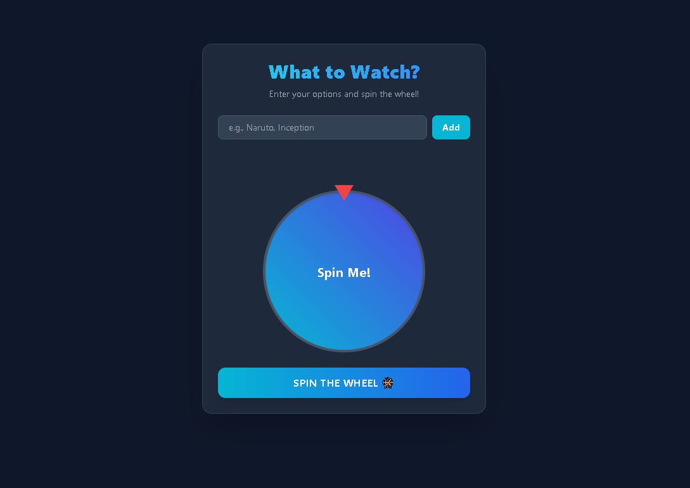

# 🎡 Movie & Anime Decision Maker

An interactive digital decision wheel built with **HTML5, Tailwind CSS, and Vanilla JavaScript** that helps users randomly choose a movie or anime to watch.

Users can add their own choices, manage them dynamically, and spin the wheel to receive a random selection.

## 🌐 Live Demo

👉 **[View Live Demo]()**

## 📸 Preview



## ✨ Features

- 🎬 **Dynamic Choice Management**
  - Add custom movie or anime options to the decision wheel.
  - Remove existing choices whenever needed.

- 🏷️ **Interactive Choice Badges**
  - Added choices are displayed as interactive badge-style elements.
  - Badges are generated dynamically using Vanilla JavaScript.

- 🎡 **Random Decision Wheel**
  - Spin the wheel to randomly select one of the available choices.
  - Uses randomized JavaScript degree calculations to determine the wheel's result.

- 🔄 **Smooth Wheel Rotation**
  - Uses CSS/Tailwind transition behavior to create a smooth spinning experience.

- 🌏 **Movie & Anime Choice Testing**
  - The interface has been tested with English and Hindi movie choices, including examples such as **Baaghi, Encounter, and BusinessMan**.

- 📱 **Responsive Interface**
  - Designed to provide a clean interactive experience across different screen sizes.

## 🛠️ Tech Stack

| Technology | Purpose |
|---|---|
| HTML5 | Page structure and interactive interface elements |
| Tailwind CSS | Utility-based styling, responsive layouts, and wheel animations |
| Vanilla JavaScript | Choice management, badge rendering, randomization, wheel rotation, and DOM manipulation |

## ⚙️ How It Works

1. Enter a movie or anime name.
2. Add the choice to the wheel.
3. Continue adding or removing choices as needed.
4. Press the **Spin** button.
5. The wheel rotates using a randomized rotation value.
6. The wheel selects one of the available choices.

## 🎯 Project Highlights

This project focuses on building an interactive browser-based decision-making experience while implementing:

- Dynamic user-generated options
- Add/remove functionality
- DOM element creation and manipulation
- Interactive badge rendering
- Random selection logic
- Randomized wheel rotation
- CSS transition animations
- Responsive Tailwind CSS interface

## 📂 Project Structure

```text
movie-anime-decision-wheel/
│
├── index.html
├── assets/
│   └── screenshot.png
│
└── README.md
